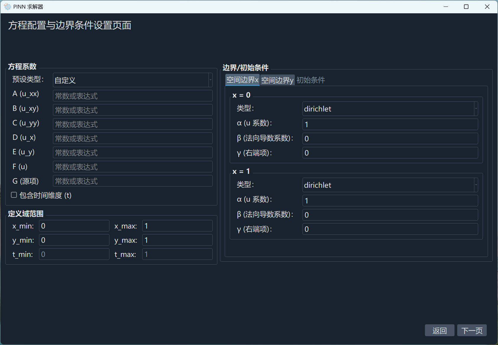
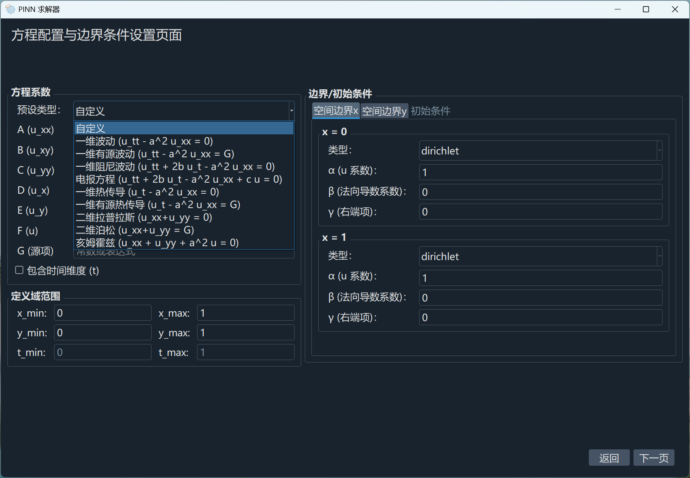
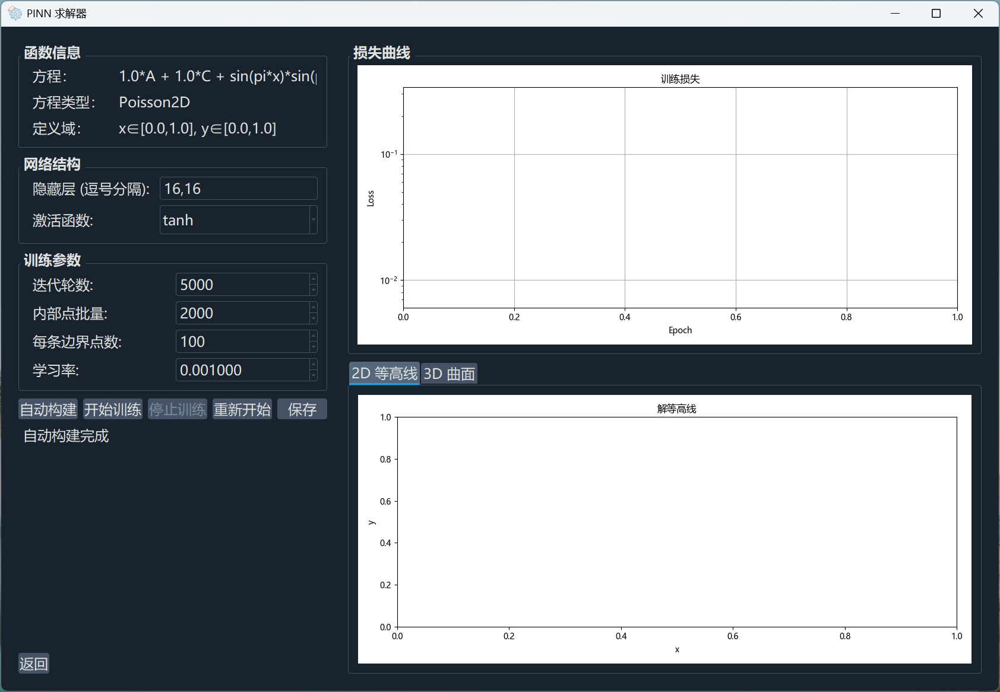
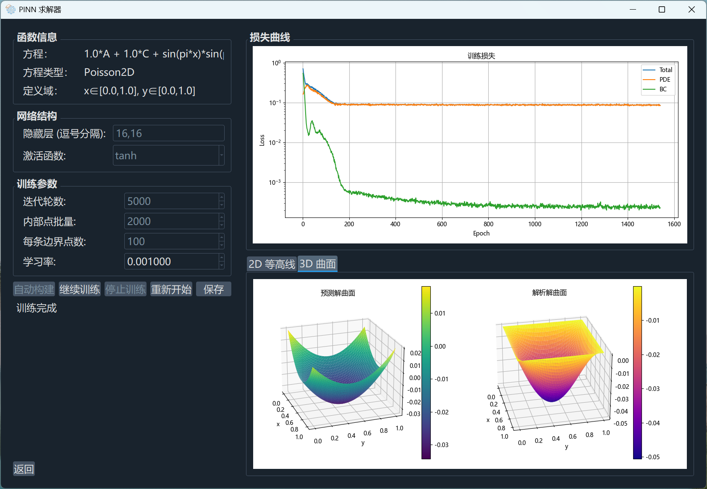

# 基于机器学习的偏微分求解（大一立项）

本项目暂定目标是基于 PINN 实现对 **二阶偏微分方程** 的求解，并通过图形界面实时可视化呈现损失曲线与解曲面。  
网络搭建基于 `PyTorch` 库，图形界面搭建基于 `PyQt5` 库和 `qt designer`，方程解析解基于 `numpy`、`sympy`、`scipy` 等数学库。  
到项目中期，已完成对图形界面主体的搭建，内置求解器可对部分不含时间的二阶偏微分方程进行求解，内置自动网络架构可对大部分方程进行逼近（需要手动调参），对部分特定测试函数的求解损失已达到预期。  
**（当前代码为初版，未经重构，含有大量废弃和测试代码，可读性差，仅供参考。）**

## 1. 文件结构
```
.
├── config/                          # 配置文件目录
│   └── save_counter.json            # 训练结果保存依据（因当前不支持修改保存路径）
├── images/                          # 图片资源文件
├── notebooks/                       # .ipynb文件，用于展示测试（暂未使用）
│   └── ...
├── results/                         # 训练结果保存文件（本地）
│   ├── figures/                     # 训练结果图像
│   ├── logs/                        # 训练的方程和条件
│   └── models/                      # 训练完成的有效网络配置
├── scripts/                         # 可执行脚本
│   └── train_pinn.py                # 不含图形界面的测试文件（暂未使用）
├── src/                             # 核心源代码
│   ├── __init__.py                  # 把 src 文件打包为一个库供外部导入
│   ├── data_utils.py                # 采样点生成器（内部点、边界点）
│   ├── function_factory.py          # 方程、边界条件配置与解析
│   ├── gui.py                       # PyQt5 图形界面主程序
│   ├── network_factory.py           # 神经网络构建与复杂度分析
│   ├── trainer.py                   # 训练器与损失函数
│   └── visualization.py             # 可视化工具函数
├── ui/                              # Qt Designer 界面文件以及窗口图标
│   ├── EquationPage.ui              # 方程配置页面
│   ├── TrainVisualizePage.ui        # 训练与可视化页面
│   └── ...                          # 窗口图标和背景照片
├── .gitignore                       # git 配置文件
├── README.md                        # 本文件
├── build1.bat                       # 环境搭建脚本
├── build2.bat                       # Python 安装脚本
├── build3.bat                       # 库安装脚本
├── logo.ico                         # 桌面图标
├── main.py                          # 主进入函数，用于外部打包
└── test.py                          # 代码重构（暂未完成）
```

## 2. 运行方式

**1. 环境配置**：

- 把全部文件拉取到本地，进入 Conda 的 base 环境，进入项目根目录，输入运行 `build1.bat`，搭建新环境
- 输入 `conda activate pde_pinn_env`，进入新建环境，输入运行 `build2.bat`，安装 Python
- 输入运行 `build3.bat`，安装依赖库，该过程需要十分钟左右，过程中出现报错是正常现象，等待出现安装成功提示即可

**2. 启动程序**：

- 输入运行 `python main.py` 即可使用完整功能

**3. 打包程序（分发时用）**：

- 在项目根目录输入 `pyinstaller main.py --noconsole --hidden-import PyQt5.QtXml --icon="logo.ico"`，等待约十分钟
- 项目根目录下会出现 `build/` 和 `dist/` 两个文件夹，打包好的可执行文件在 `dist/main/` 文件夹中
- 若运行时提示缺失文件，需要手动把项目根目录中的 `ui/` 文件夹复制到 `dist/main/_internal/` 文件夹中

## 3. 使用说明

### 1. 欢迎页

直接运行 Python 文件或打包好的可执行文件，进入欢迎页，点击右下角退出程序；点击中间按钮进入方程配置页；运行过程中任意时刻可通过右上角关闭窗口。  


### 2. 方程配置页

方程配置页如下：  


首先在左上方点击下拉框可选择类型，目前对最后三种类型的功能实现较为完善（因为不含时间变量），其他类型还没有实现解析解处理和完整测试。  
对于自定义类型，还有一个勾选框决定方程是否含有时间变量。  
选择完类型后，需要填入方程系数和源项（A~G），可填写常数或者 sympy 表达式，对于灰掉的框，可通过鼠标悬停了解不可用的原因。  
然后需要填写定义域（默认可不改）和右侧的条件约束（默认可不改），定义域只能填写数字，条件约束允许填写表达式。  
填写完成所有方程配置后，可点击下一页进入训练可视化页，程序会自动分析配置并构建网络和解析解（仅部分支持），有时会有轻微卡顿（因计算解析解线程暂未分离），若输入不合规，会弹窗提示修改。  



### 3. 训练可视化页

训练可视化页如下：  
进入该界面时，会进行自动搭建，可直接开始训练，也可以修改配置开始训练，若想回到自动配置只需点击自动构建按钮。  
训练过程可暂停，或者等待轮数耗尽自动暂停，暂停可以观察当前训练状况，可选择轻度调参，继续训练，也可以重新开始。  


训练停止后会绘制对比图，作为分析参考。  
对于比较好的训练结果，可以点击保存按钮，训练数据会自动保存到项目根目录的 `results/` 文件夹中（若为打包好的可执行文件，结果保存在 `_internal/results/` 中）。  


### 4. 部分异常情况说明

- 若输入表达式过于复杂，可能导致误差极大，解析解精度丧失（控制台输出警告但程序还能运行），卡顿；
- 当前对自定义边界系数的支持有限，可能无法正常训练；
- 随着训练轮数或采样点增加，会逐渐出现卡顿现象；
- 隐藏层参数输入缺乏校验，非法输入导致解析失败或崩溃；
- 源项对填入表达式校检不足，可能会出现除零错误；
- 定义域输入框和边界条件系数输入框未校验是否为合法数值，NaN 传入后污染采样坐标；
- 对于源项较为复杂的方程，网络无法学习到有效特征；
- 待补充。

## 4. 进度提要

- 项目于 2025 年 10 月底立项，小组成员在前期完成了《动手学深度学习 PyTorch 版》前三章的学习，掌握了线性神经网络、多层感知机及自动微分的基础。
- 2026 年 3 月完成第一阶段，实现了对一维泊松方程的 PINN 求解并在 jupyter 脚本可视化。
- 2026 年 4 月完成对《数学物理方法》的学习，对常见二阶偏微分方程的类型及其级数解的求法有了初步了解。
- 2026 年 5 月进行系统培训，同时制定中期及结题主要目标。
- 2026 年 6 月完成 PyQt5 图形界面三页面（欢迎页、方程配置页、训练可视化页）的初步集成，支持实时绘图与训练控制。

## 5. 参考资料

- 主要参考：《动手学深度学习 PyTorch 版》、《数学物理方法顾樵版》
- PINN 相关：理解 PINN 的基本原理与损失函数构造（通过文献与 AI 辅助对话）
- PyQt5 开发：Qt 官方文档、PyQt5 示例代码、白月黑羽官方学习网站
- 辅助工具：DeepSeek（代码生成与调试指导）、CSDN 社区（环境配置与问题排查）

## 6. 问题与解决

### 6.1 符号表达式解析与变量管理

- **问题**：对输入表达式的解析硬编码，可扩展性极差，后期调试费时费力。
- **解决**：暂未解决。

### 6.2 采样器对时间维度的统一处理

- **问题**：处理初始条件和边界条件的组合时，无法合理分开判定逻辑。
- **解决**：为简化模型，暂时将时间 `t` 当作第二个空间维度（即“y”）处理，但出现很多其他问题。

### 6.3 可视化界面设计与逻辑处理

- **问题**：当前界面存在大量逻辑不完备的地方，对多种极端输入暂未测试和处理。
- **解决**：暂未解决。

### 6.4 多线程处理

- **问题**：为了保持界面流畅，需要把训练和求解过程放在单独的线程，目前有简要实现，但未达预期。
- **解决**：暂未解决。

### 6.5 解析解扩展

- **问题**：目前只对极少部分方程进行了解析解处理，还需扩展。
- **解决**：暂未解决。

## 7. 下一步规划

- **重构代码**：增强可维护性和可读性。
- **泛化能力提升**：当前仅支持部分二阶线性 PDE 通式，下一步计划扩展至更多类型。
- **自适应采样**：对不同边界条件和初始条件进行区分处理，同时计划扩展至多种边界（如椭圆边界）。
- **解析解自动生成**：完善 `generate_analytical_solution` 函数，支持更多方程类型的级数解自动推导与可视化对比。
- **提高精度**：设计更智能的参数工厂，实现更高精度的逼近。
- **优化网路架构**：当前使用的仍旧是简单的线性层和常规激活函数堆砌的多层感知机，计划尝试 CNN、KNN 等其他构型。

